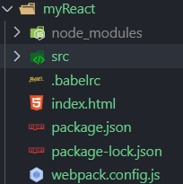
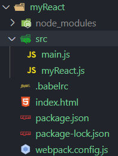

# 《读了这篇文章后，我自己也可以开发 React 框架了！》

> 文章首发于公众号《玉丸子》，项目已经放到 github：https://github.com/suyuhuan/toyReact
> 觉得可以的话，给个 star 鼓励下呗！
> 有什么不对的或者建议或者疑惑，加 wx:yuhuan_su 一起探讨鸭！
> 如需转载请说明来源

做了几年的前端开发的人都知道，开发到了一定阶段我们就会遇到一些技术开发上的瓶颈，显然看着开发文档开发功能是远远不够的，更希望能够自己从源码层面上能做一些事情。可是事与愿违，大家开发的框架都是通过的几年甚至上十年的技术沉淀，个人一时半会也研究不出个大概来。去网上找教程找源码分析，学完以后就会有种似懂非懂的感觉。然后自己动手做点什么事情出来，还是不会，为什么会这样子？其实很多时候我们是学习了他整个枝枝叶叶甚至也学习了他的主干，但是就是不知道他的根到底在哪？

那么今天我写的这篇文章，就是想手把手教你怎么从 react 的根开始做起，开发属于自己的 react 框架。大家准备好了没？ 我要开车了。

在这段时间里，我会手把手教你从 react 的 JSX 实现、生命周期的实现、虚拟 DOM 的实现三个方面直击 react 核心，教你一步一步搭建你自己的 React 框架。

在正式开始前，我默认你已经有了 nodejs 的开发环境，如果没有我希望你能安装一个 nodejs 环境，这个我就不多说了，大家去 nodejs 官网直接下载安装就好。

### react 开发环境的基础搭建工作

接下来我来带大家，做 react 开发环境的基础搭建工作。

#### 第一步，我们首先创建一个 myReact 文件包（以后我们就在这个文件项目里工作）。然后打开终端，在文件包中输 npm init 初始化一个 package.Json 文件。

#### 第二步，我们需要 npm 安装一些开发使用的工具库。

在终端依次输入：

```js
npm install @babel/core --save-dev
npm install @babel/plugin-transform-react-jsx --save-dev
npm install @babel/preset-env --save-dev
npm install babel-core --save-dev
npm install babel-loader --save-dev
npm install webpack --save-dev
npm install webpack-cli --save-dev
npm install webpack-dev-server --save-dev
```

假如你的 package.json 文件是如下一样（工具版本号根据安装的时间来定的不要过于担心，为了避免调试你也可以跟我同步），恭喜你工具库已经安装完成！

```js
{
  "name": "myReact",
  "version": "1.0.0",
  "description": "",
  "main": "index.js",
  "scripts": {
    "webpack": "webpack",
    "start": "webpack-dev-server"
  },
  "author": "",
  "license": "ISC",
  "dependencies": {},
  "devDependencies": {
    "@babel/core": "^7.10.4",
    "@babel/plugin-transform-react-jsx": "^7.10.4",
    "@babel/preset-env": "^7.10.4",
    "babel-core": "^6.26.3",
    "babel-loader": "^8.1.0",
    "webpack": "^4.43.0",
    "webpack-cli": "^3.3.12",
    "webpack-dev-server": "^3.11.0"
  }
}
```

#### 第三步，当工具包已经完成以后，我们要对工具包做一些基础的配置才可以使用他。我们需要对 babel 工具和 webpack 工具做配置，于是，我们需要创建.babelrc 和 webpack.config.js 两个配置文件。

我们在.babelrc 配置文件写入如下配置：

```js
{
    "plugins": [
        [
            "@babel/plugin-transform-react-jsx",
            {"pragma":"myReact.createElement"}
        ]
    ]
}
```

我们在 webpack.config.js 配置文件写入如下配置：

```js
const path = require("path");
module.exports = {
  entry: {
    main: path.resolve(\_\_\_\_\_\_dirname, "./src/main.js"),
  },
  mode: "development",
  module: {
    rules: [
      {
        test: /\.js$/,
        use: {
          loader: "babel-loader",
        },
      },
    ],
  },
  optimization: {
    minimize: false,
  },
};
```

更多配置请查阅官网。》》》

#### 第四步，在 myReact 项目文件夹中，创建 src 文件夹和 index.html 入口文件

完成以上工具安装，工具配置及文件创建步骤以后，我们最后的文件目录如下图所示：



这样子我们就已经完成了开发 React 所需要的基础工作了。

接下来我们正式进入 myReact 框架开发的编码阶段。

### myReact 框架开发的编码

#### 第一步，首先我们在 src 文件夹中，创建自己的 react 框架文件，这里我命名为 myReact.js，以后这个文件就是我们需要撰写自己的 react 框架核心代码。然后再创建一个 mian.js 文件，用这个文件来编写测试自己的 myReact.js 框架的初始代码。

创建项目目录如下：



#### 第二步，在我们的 index.html 文件中，写入如下代码：

```js
<!DOCTYPE html>
<html lang="en">
<head>
    <meta charset="UTF-8">
    <meta name="viewport" content="width=device-width, initial-scale=1.0">
    <title>myReact框架</title>
</head>
<body>
    <div id="app"></div>
</body>
<script src="./main.js"></script>
</html>
```

这里我就不对代码做太多解释，如同其他前端框架使用一样，是一个项目的入口文件。

我在编写自己的 myReact 框架前，首先我们回忆一下，自己平时是怎么开始使用 react 框架来写自己的组件的？是不是如下所示：

```js
class MyComponent extends Component {
  render() {
    return (
      <div>
                       <span>hello</span>
                      <div>{this.children}</div>
                    
      </div>
    );
  }
  setAttribute(name, vaule) {
    this[name] = vaule;
  }
  mountTo(parent) {
    let vdom = this.render();
    vdom.mountTo(parent);
  }
}
let a = (
  <MyComponent name="a" id="ida">
        <div>123</div>
  </MyComponent>
);
myReact.render(a, document.body);
```

好！就这样我们从开始使用的状态来倒推 react 的核心逻辑。

#### 第三步，于是我们就在 main.js 文件中，编写自己使用 myReact 框架的测试代码如下：

```js
import { myReact, Component } from "./myReact.js";

class MyComponent extends Component {
  render() {
    return (
      <div>
                       <span>hello</span>
                      <div>{this.children}</div>
                    
      </div>
    );
  }
  setAttribute(name, vaule) {
    this[name] = vaule;
  }
  mountTo(parent) {
    let vdom = this.render();
    vdom.mountTo(parent);
  }
}
let a = (
  <MyComponent name="a" id="ida">
        <div>123</div>
  </MyComponent>
);
myReact.render(a, document.body);
```

那么我们的 myReact 到底怎么设计？他到底是怎么工作的呢？

（React = 组件化 + jsx + vdom）

首先我们来回忆一下 react 的原理，
《待续》。。。

> 如需转载请说明来源
